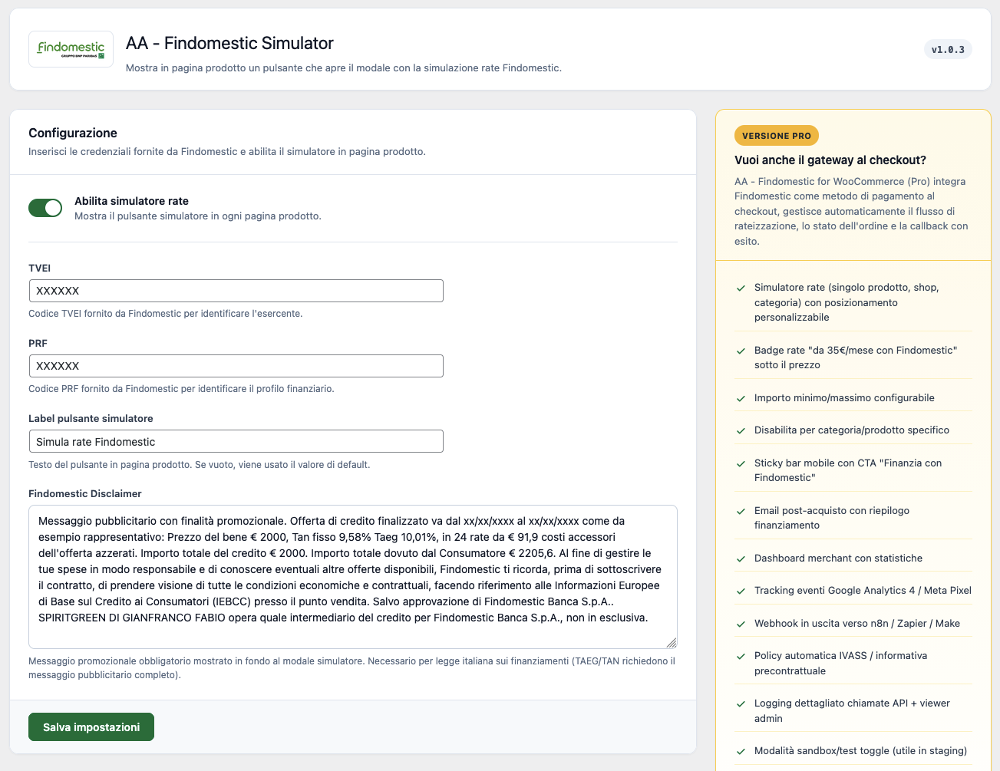
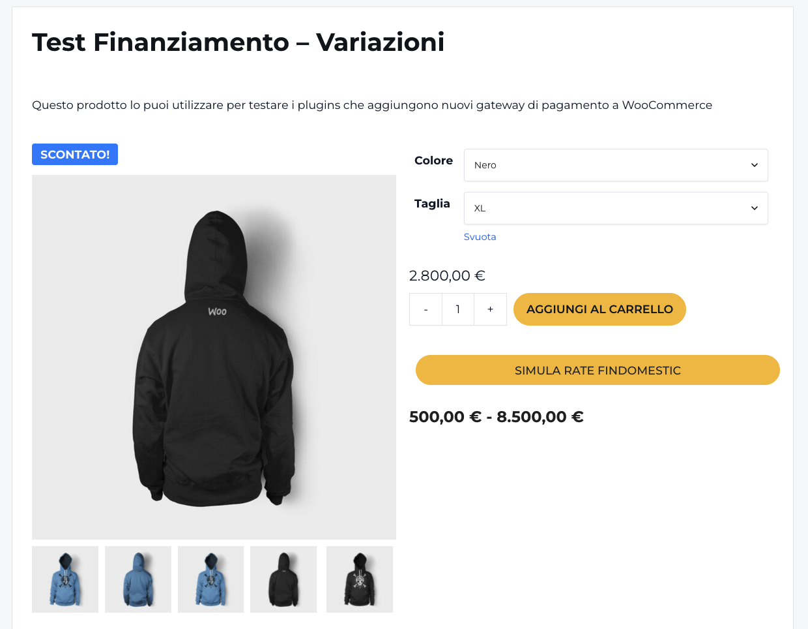
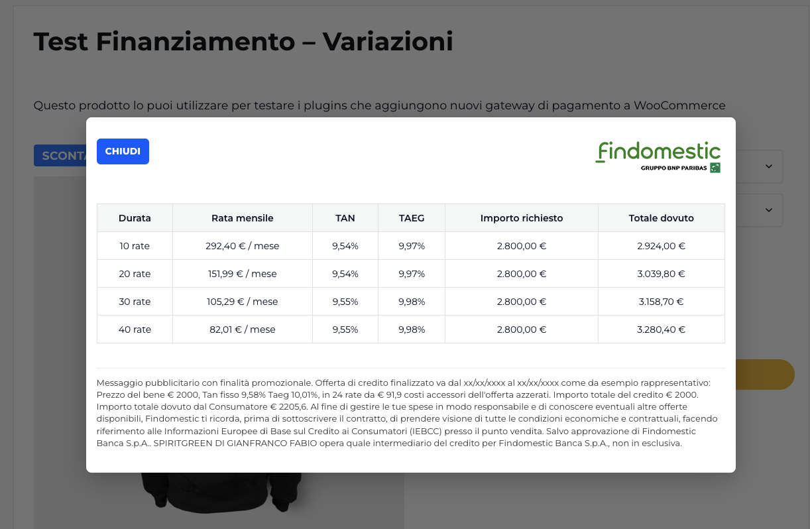

# AA - Findomestic Simulator

**Contributors:** alessioangeloro  
**Tags:** woocommerce, findomestic, finanziamento, simulatore rate, rateizzazione  
**Requires at least:** WordPress 6.0  
**Tested up to:** WordPress 6.7  
**Requires PHP:** 7.4  
**Stable tag:** 1.0.2  
**License:** GPLv2 or later  
**License URI:** https://www.gnu.org/licenses/gpl-2.0.html  

Simulatore Rate Findomestic per WooCommerce. Mostra in pagina prodotto un pulsante che apre un modale con la simulazione del finanziamento.

## Description

**AA - Findomestic Simulator** integra in WooCommerce il simulatore rate Findomestic. In ogni pagina prodotto compare un pulsante che, al click, apre un modale con il dettaglio delle rate disponibili: durata, importo mensile, TAN e TAEG calcolati sull'importo del prodotto.

Il plugin è pensato per i merchant italiani che vogliono mostrare ai propri clienti la possibilità di finanziare l'acquisto con Findomestic, anche prima di completare l'ordine.

## Funzionalità

- Pulsante **"Simula rate Findomestic"** in ogni pagina prodotto
- Modale responsive con tabella delle rate disponibili
- Importo simulato basato sul prezzo reale del prodotto, incluse le varianti per prodotti variabili
- Disclaimer Findomestic configurabile, necessario per la comunicazione sui finanziamenti
- Compatibile con prodotti semplici e variabili
- Importo minimo simulazione: **1.000 €**, come da policy Findomestic

## Credenziali Findomestic

Per usare il simulatore servono i codici **TVEI** e **PRF** forniti da Findomestic al merchant. Senza queste credenziali il simulatore non può chiamare l'API Findomestic.

## Versione Pro

Per chi vuole anche integrare Findomestic come metodo di pagamento al checkout, con gestione completa dell'ordine, redirect e callback con esito della pratica di finanziamento, è disponibile la versione Pro **AA - Findomestic for WooCommerce**.

La versione Pro è distribuita su:

[https://alessioangeloro.it/prodotto/findomestic-per-woocommerce/](https://alessioangeloro.it/prodotto/findomestic-per-woocommerce/)

Se installi la Pro mentre la Lite è attiva, **AA - Findomestic Simulator** si auto-disattiva per evitare duplicazioni.

## Installation

1. Carica la cartella `aa-findomestic-simulator` in `/wp-content/plugins/` oppure installa il plugin direttamente dalla schermata Plugin di WordPress.
2. Attiva il plugin dalla schermata Plugin di WordPress.
3. Vai in **Impostazioni > Findomestic Simulator**.
4. Inserisci i codici **TVEI** e **PRF** forniti da Findomestic.
5. Spunta **"Abilita simulatore rate"**.
6. Personalizza eventualmente il testo del pulsante e il disclaimer Findomestic.
7. Salva. Il pulsante apparirà in ogni pagina prodotto WooCommerce.

## Frequently Asked Questions

### Posso usare il plugin senza credenziali Findomestic?

No. Le credenziali **TVEI** e **PRF** sono necessarie per chiamare l'API di simulazione Findomestic. Devi richiederle al tuo referente Findomestic.

### Il plugin gestisce anche il pagamento al checkout?

No. **AA - Findomestic Simulator** si occupa solo della simulazione rate in pagina prodotto. Per integrare Findomestic come metodo di pagamento al checkout serve la versione Pro.

### Funziona con prodotti variabili?

Sì. Per i prodotti variabili il pulsante diventa attivo dopo la selezione di tutte le varianti. Se l'utente clicca prima di selezionare le varianti, viene mostrato un messaggio che indica quale variante manca.

### Cos'è l'importo minimo di 1.000 €?

È il limite minimo richiesto da Findomestic per poter simulare un finanziamento. Per prodotti sotto i **1.000 €** il pulsante non viene mostrato.

### Dove vengono inviati i dati?

I dati di simulazione, cioè importo del prodotto e codici TVEI/PRF dell'esercente, vengono inviati ai server Findomestic per calcolare le rate. Vedi la sezione **External services** per i dettagli.

## External services

Questo plugin si connette ai server Findomestic per ottenere la simulazione delle rate. Senza questa chiamata il modale rate non può funzionare.

**Servizio:** Findomestic Banca S.p.A. – API simulazione rate ecommerce

### Endpoint chiamati

- `https://secure.findomestic.it/clienti/webapp/ecommerce/` – fetch della sessione iniziale
- `https://secure.findomestic.it/b2c/ecm/v1/order/create` – creazione ordine simulazione
- `https://secure.findomestic.it/b2c/ecm/v1/order?token={token}` – aggiornamento dati ordine
- `https://secure.findomestic.it/b2c/ecm/v1/order/{order_id}/offer` – richiesta offerte rateali

### Quando viene effettuata la chiamata

La chiamata viene effettuata quando un visitatore del sito clicca sul pulsante **"Simula rate Findomestic"** in pagina prodotto.

### Dati inviati

- Importo del prodotto, in euro
- Codice TVEI dell'esercente, configurato dall'admin nelle settings
- Codice PRF dell'esercente, configurato dall'admin nelle settings
- Header HTTP standard, come User-Agent, Origin e Referer

### Dati personali dell'utente

Nessun dato personale del visitatore viene inviato a Findomestic in fase di simulazione. Vengono inviati solo l'importo del prodotto e le credenziali dell'esercente.

### Link utili Findomestic

- [Termini di servizio Findomestic](https://www.findomestic.it/)
- [Privacy policy Findomestic](https://www.findomestic.it/privacy)

## Screenshots

> Carica gli screenshot nella cartella `assets/screenshots/` del repository GitHub e poi aggiorna i percorsi qui sotto se usi nomi diversi.

### 1. Pagina settings del plugin

### 2. Pulsante simulatore in pagina prodotto

### 3. Modale con tabella delle rate

## Changelog

### 1.0.3

- Prima release pubblica del simulatore rate Findomestic per WooCommerce.
- Aggiunto supporto per prodotti semplici e variabili.
- Aggiunta pagina settings con TVEI, PRF, testo pulsante e disclaimer.
- Aggiunta gestione auto-disattivazione in presenza della versione Pro.

## License

Questo plugin è distribuito con licenza **GPLv2 or later**.

Vedi: [https://www.gnu.org/licenses/gpl-2.0.html](https://www.gnu.org/licenses/gpl-2.0.html)
